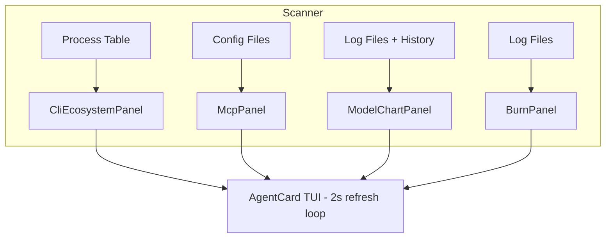

<!-- prettier-ignore -->
<div align="center">

# ⬡ AgentCard

[](https://python.org)
[](https://textual.textualize.io)
[](https://github.com/giampaolo/psutil)
[](LICENSE)
<br>
[](https://github.com/shafiqimtiaz/agent-card/releases)
[](https://github.com/shafiqimtiaz/agent-card)

Terminal dashboard that shows what's running in your agentic AI coding ecosystem — 16 CLI detectors, MCP server discovery, model usage charts, and token burn metrics, all in four dense quadrants.

[Features](#features) • [Installation](#installation) • [Usage](#usage) • [Architecture](#architecture) • [How It Works](#how-it-works)

</div>

AgentCard is a single-file Python TUI that scans your local machine to give you a live picture of your AI tooling landscape. It detects running agentic CLI processes, finds installed MCP servers, tallies model usage from shell history and log files, and estimates token burn rates — all without ever making a network request.

> [!NOTE]
> AgentCard runs entirely locally. No telemetry, no outbound calls, no external services. It reads the process table, configuration directories, and log files on your machine and renders the results in your terminal.

## Features

- **16 CLI detectors** — Scans for Claude Code, Codex, GitHub Copilot CLI, Gemini CLI, Cursor, Amp, Cline, Roo Code, Kilo Code, Kiro, Crush, OpenCode, Factory Droid, Antigravity, Kimi CLI, and Qwen Code
- **MCP discovery** — Aggregates tool servers from `~/.claude`, `~/.cursor`, `~/.opencode`, `~/.n8n` and other standard config paths
- **Model frequency charts** — Parses terminal history and log files for model mentions, renders horizontal ASCII bars
- **Token burn analytics** — Sessions, token velocity, input/output splits, and estimated cost from local logs
- **2-second auto-refresh** — Live updates so you can watch your ecosystem change as you work
- **Demo mode** — Built-in realistic mock data for previews, screenshots, or evaluation

## Installation

```bash
pip install textual psutil
```

> [!TIP]
> The app degrades gracefully without psutil (process scanning falls back to config-directory detection only). Textual is the only hard requirement.

## Usage

```bash
# Live mode — scans actual running processes and local configs
python agent_card.py

# Demo mode — realistic mock data, perfect for screenshots
python agent_card.py --demo
```

### Keyboard shortcuts

| Key | Action |
|-----|--------|
| `q` | Quit the application |
| `r` | Force an immediate refresh |
| `d` | Toggle between demo and live scanning |
| `t` | Toggle dark/light color theme |

## Architecture

The dashboard is divided into four quadrants, each responsible for a different slice of data. A single `Scanner` class collects all information locally every two seconds.



## How it works

### Quadrant 1 — Active CLI Ecosystem

Scans the OS process table (via psutil) and checks well-known configuration directories for each of the 16 target CLIs. Every tool is shown with one of four states:

| State | Meaning |
|-------|---------|
| 🟢 `RUNNING` | Active process found (PID, CPU, memory, uptime shown) |
| 🟡 `IDLE` | Configuration directory present but no active process |
| ⚪ `DETECTED` | Partial traces (e.g. VS Code extension artifacts) |
| `ABSENT` | Nothing found |

### Quadrant 2 — Skills & MCP Discovery

Reads MCP server configuration files from standard locations (`~/.claude/mcpServers.json`, `~/.cursor/mcp.json`, `~/.n8n/mcp.json`, and others) and aggregates the servers found, grouped by source tool. Each entry shows the server name and the number of tools it exposes.

### Quadrant 3 — Most Used Models

Walks log directories (`~/.claude`, `~/.cursor`, etc.) and shell history files (`~/.bash_history`, `~/.zsh_history`) for model name patterns. The top models are ranked with horizontal ASCII progress bars showing relative frequency.

```text
claude-4-sonnet   ████████████████████ 31.5% (847)
claude-3.7-sonnet █████████████████░░░ 23.2% (623)
gpt-4.1           ███████████████░░░░░ 15.3% (412)
claude-4-opus     ██████████░░░░░░░░░░ 10.7% (289)
o4-mini           █████░░░░░░░░░░░░░░░  7.4% (198)
```

### Quadrant 4 — Performance & Burn

Extracts token usage from JSONL and JSON log files and computes:

- Total token volume with input/output breakdown
- Estimated cost (blended rate: $3/M input, $15/M output tokens)
- Token velocity (tokens per minute)
- Session count and average tokens per session
- Environment integrity index — verifies `python3`, `node`, `git`, and `pip3` are on PATH

```text
┌─ Token Economics ────────────────────┐
│ Total Tokens      2.8M               │
│   Input  ████████████████░░ 66.7%    │
│   Output ████████░░░░░░░░░░ 33.3%    │
├─ Financial ──────────────────────────┤
│ Est. Cost        $18.4700            │
│ Burn Rate        $0.0385/min         │
│ Velocity         14.2K/min           │
├─ Sessions ───────────────────────────┤
│ Sessions             142             │
│ Avg/Session       20.1K              │
├─ Environment ────────────────────────┤
│ Integrity  █████████████████░░░ 85%  │
└──────────────────────────────────────┘
```

## What gets scanned

<details>
<summary><strong>16 CLI platforms and their detection signals</strong></summary>

| Platform | Process match | Config path |
|----------|--------------|-------------|
| Claude Code | `claude*` | `~/.claude` |
| Codex | `codex*` | `~/.codex` |
| GitHub Copilot CLI | `copilot*` | `~/.copilot` |
| Gemini CLI | `gemini*` | `~/.gemini` |
| Cursor | `cursor` | `~/.cursor` |
| Amp | `amp*` | `~/.amp` |
| Cline | — | `~/.cline`, VS Code ext |
| Roo Code | `roo*` | `~/.roo` |
| Kilo Code | `kilo*` | `~/.kilo` |
| Kiro | `kiro` | `~/.kiro` |
| Crush | — | `~/.crush` |
| OpenCode | `opencode` | `~/.opencode` |
| Factory Droid | `factory-droid` | `~/.factory-droid` |
| Antigravity | `antigravity*` | `~/.antigravity` |
| Kimi CLI | `kimi*` | `~/.kimi` |
| Qwen Code | `qwen*` | `~/.qwen` |

</details>

<details>
<summary><strong>Scanned model names (20 patterns)</strong></summary>

claude-4-opus, claude-4-sonnet, claude-3.7-sonnet, claude-3.5-sonnet, claude-3-haiku, gpt-4.1, gpt-4o, gpt-4-turbo, o4-mini, o3, o3-mini, o3-pro, gemini-2.5-pro, gemini-2.5-flash, gemini-2.0-flash, deepseek-v3, deepseek-r1, qwen-3, llama-4

</details>

> [!TIP]
> The scanner walks common log directories up to 4 levels deep and recognizes `.log`, `.jsonl`, `.json`, and `.txt` files. Custom log locations can be added by modifying the `scan_dirs` list in `scan_models()` and `scan_burn()`.

## Tech stack

- **[Textual](https://textual.textualize.io)** — Python TUI framework (v8+). Provides reactive widgets, timers, and CSS-based layout.
- **[psutil](https://github.com/giampaolo/psutil)** — Cross-platform process and system monitoring.
- **Python 3.10+ standard library** — All scanning logic uses built-in modules (`json`, `re`, `pathlib`, `os`, `subprocess`). No other dependencies.

## Running from source

```bash
git clone https://github.com/shafiqimtiaz/agent-card.git
cd agent-card
pip install textual psutil
python agent_card.py --demo
python agent_card.py
```
